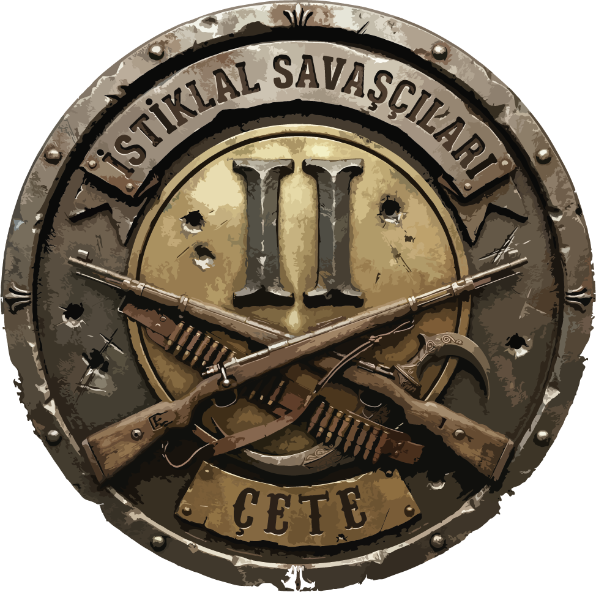
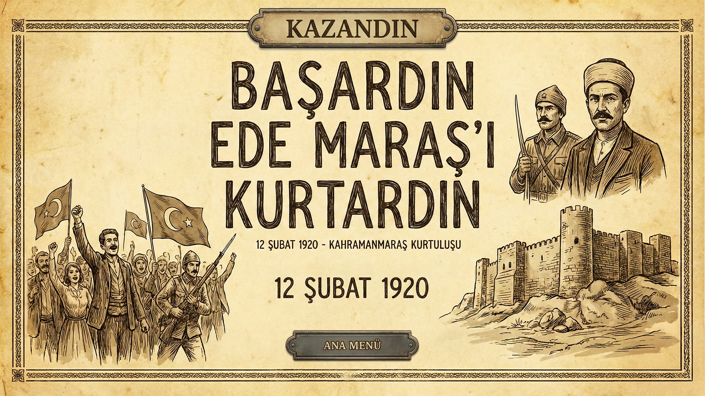

# ⚔️ İstiklal Savaşçıları 2: Çete (Warriors of Independence 2: The Gang)

[-blue.svg?logo=unity)](https://unity.com/)
[](https://unity.com/srp/universal-render-pipeline)
[-gold.svg?logo=trophy)](https://github.com/Edyboziron/istiklalSavascilari2)
[](https://github.com/Edyboziron/istiklalSavascilari2)

<p align="center">
  
</p>

> 🏆 **Winner of "Best Mechanics" (En İyi Mekanik) Category Award at Madalyon Game Jam!**

---

## 📖 Overview

**İstiklal Savaşçıları 2: Çete** is a real-time tactical auto-battler and strategy game developed for the **Madalyon Game Jam**. Inspired by the heroic local resistance bands (*Kuva-yi Milliye / Çete*) during the Turkish War of Independence (*Kurtuluş Savaşı*), the game challenges players to command and deploy frontline fighters and marksmen to defend Anatolian territories against advancing hostile forces, culminating in the historic liberation of Maraş.

Built within a tight jam timeframe using **Unity 6** and the **Universal Render Pipeline (URP)**, the project blends tactical pre-combat placement, dynamic resource management, and intelligent autonomous combat routines.

---

## 🎮 Core Mechanics & Features

> *The game was awarded **Best Mechanics** for its engaging synergy between tactical deployment, resource-preservation economy, and autonomous combat behavior.*

<p align="center">
  
</p>

### 1. 📐 Tactical Grid Placement (`BuildingManager.cs` & `DragDropItem.cs`)
- **Drag-and-Drop Deployment**: Intuitive unit positioning using Unity's New Input System, supporting both mouse cursor and touch inputs.
- **Layer & Snapping Validation**: Units are projected onto the battlefield via Raycasts against dedicated terrain and building layers, preventing overlaps and out-of-bounds drops.
- **Smart Refund Safety**: If a placement is cancelled or obstructed, gold is preserved immediately.

### 2. ⚔️ Autonomous Hybrid Combat (`CombatSystem.cs` & `RangedCombatSystem.cs`)
- **Melee Combatants**: Advance towards nearest targets, trigger smooth blend tree animations (`Run`, `Attack`, `Die`), and deliver melee blows when inside attack range.
- **Ranged Marksmen**: Position themselves at standoff distances, track targets with dynamic field-of-view checks, and fire physics-based ballistic projectiles (`Projectile.cs`).
- **Dynamic Target Prioritization**: Active target scanning with periodic frequency routines (`UpdateTarget`), automatically re-evaluating priorities when targets fall in battle.

### 3. 💨 Tactical Dash System (`SmoothDash.cs`)
- **Repositioning & Evasion**: Specialized ranged fighters possess a smooth burst-dash mechanic that allows them to quickly break away from melee chokepoints, reposition on the flank, and instantly reset target acquisition.

### 4. 💰 Economy & Survival Incentive (`GoldManager.cs` & `GameManager.cs`)
- **Resource Management**: Each recruited unit has an upfront gold cost.
- **Unit Preservation Bonus**: Unlike standard auto-battlers where units are disposable, **every surviving unit awards bonus gold (`birimBasinaAltin = 50`)** at the end of each round. This incentivizes strategic positioning, protection of fragile ranged units, and thoughtful tactical execution.

### 5. 🗺️ Multi-Stage Battle Progression
- Battle through escalating hostile waves across progressive scenarios (`SampleScene` $\rightarrow$ `SampleScene 1` $\rightarrow$ `SampleScene 2` $\rightarrow$ `SampleScene 3` $\rightarrow$ `win`), carrying earned funds into tougher encounters.

---

## 🕹️ Controls & How to Play

| Action | Control (Mouse / Touch) |
|---|---|
| **Deploy Unit** | Click & Drag unit portrait from bottom panel onto the battlefield grid |
| **Inspect / Reposition** | Left-Click / Tap placed friendly unit to pick up & relocate |
| **Start Battle** | Click the **Ready / Başlat** button to resume time (`timeScale = 1`) and engage combat |
| **Camera Navigation** | Pointer drag / Arrow keys |

---

## 🛠️ Tech Stack & Architecture

- **Engine**: Unity 6 (`6000.3.13f1`)
- **Render Pipeline**: Universal Render Pipeline (URP)
- **Input System**: Unity New Input System (`com.unity.inputsystem`)
- **UI Framework**: Unity UGUI + TextMesh Pro
- **Key Scripts**:
  - `GameManager.cs` / `manager.cs`: Orchestrates game state, round timers, win/loss triggers, and stage progression.
  - `BuildingManager.cs`: Handles real-time raycasting, grid calculations, ghost preview, and placement validation.
  - `CombatSystem.cs`: Drives melee state machine, damage calculations, and animation transitions.
  - `RangedCombatSystem.cs`: Controls ranged combat logic, projectile instantiation, and fire cooldowns.
  - `SmoothDash.cs`: Executes asynchronous coroutine dashes for tactical repositioning.
  - `GoldManager.cs`: Persistent singleton managing player funds, deductions, and reward payouts.

---

## 👥 The Team & Credits

Developed with passion during **Madalyon Game Jam**:

- **Enes ([@Edyboziron](https://github.com/Edyboziron))** — *Game Designer & Game Developer*
  - Core mechanic design, grid placement systems, unit balancing, combat state logic, and gameplay programming.
- **Deniz Mirik ([@DenizMirik7](https://github.com/DenizMirik7))** — *Game Developer / Team Member*
  - Combat animations, audio management, UI integration, and scene composition.
- **Muhammet Emin Yakut** — *Game Developer / Team Member*
  - Level design, asset staging, and gameplay testing.

Special thanks to the **Madalyon Game Jam** organizers, mentors, and fellow jammers for hosting a fantastic event!

---

## 🚀 Getting Started

### Prerequisites
- [Unity Hub](https://unity.com/download)
- **Unity Editor 6000.3.13f1** (or compatible Unity 6 release)
- Universal Render Pipeline package

### Setup Steps
1. Clone this repository:
   ```bash
   git clone https://github.com/Edyboziron/istiklalSavascilari2.git
   ```
2. Open **Unity Hub** and click **Add** $\rightarrow$ select the cloned repository folder.
3. Ensure the project is opened with **Unity 6000.3.13f1**.
4. In the Unity Project window, navigate to:
   ```
   Assets/Scenes/anamenu.unity
   ```
5. Press the **Play** button in the Unity Editor to experience the game!

---

<p align="center">
  <i>Developed for Madalyon Game Jam. All rights reserved.</i>
</p>
